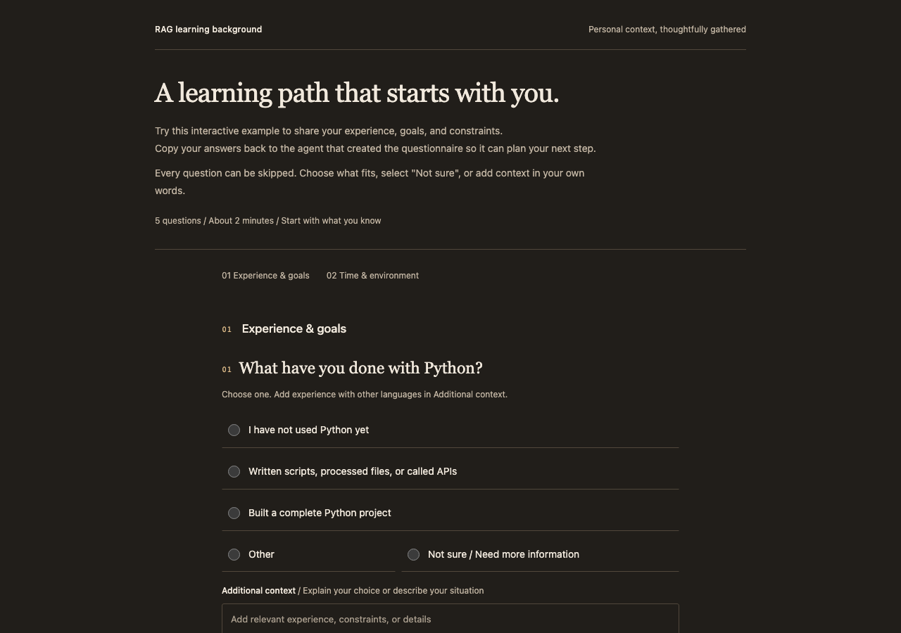

# HTML Questionnaire

**Let your AI understand you before it starts.**

Generate an offline HTML questionnaire about your background, goals, and constraints. Return compact answers to your agent so it can tailor a learning path, clarify project requirements, and choose the next step.

[简体中文](README.md) · [Try the demo](https://nabudnye.github.io/html-questionnaire/rag-learning.en.html) · [skills.sh](https://skills.sh/nabudnye/html-questionnaire/html-questionnaire)

[](https://skills.sh/nabudnye/html-questionnaire)



## Install and try this prompt

```sh
npx skills add nabudnye/html-questionnaire
```

> I want to learn RAG. Use html-questionnaire to create an HTML questionnaire about my programming experience, learning goals, and available time. Wait for my answers, then help me plan a learning path.

Skill: `html-questionnaire` · Version: `0.2.0` · Generation: Node.js 18+ · Filling: a modern browser

## Try it before installing

| Example | Live demo | Source data |
| --- | --- | --- |
| RAG learning background | [English](https://nabudnye.github.io/html-questionnaire/rag-learning.en.html) / [简体中文](https://nabudnye.github.io/html-questionnaire/) | [English JSON](examples/rag-learning.en.json) / [Chinese JSON](examples/rag-learning.zh-CN.json) |
| Personal knowledge base requirements | [Chinese demo](https://nabudnye.github.io/html-questionnaire/knowledge-base.html) | [JSON](examples/knowledge-base.zh-CN.json) |

The demos use fixed questions. Once installed, the skill helps your agent generate questions for your own task. The demo page handles filling and export only; it does not connect to a model or generate a learning plan.

You can also download the [English HTML file](docs/rag-learning.en.html) and open it locally.

## How it works

1. **Describe your task and request a questionnaire.** Ask the agent to understand your needs or background before proceeding.
2. **Open the generated HTML and fill it in.** Choose answers, add context, or skip any question.
3. **Copy Markdown or download `.md` / `.json`.** Return the answers to the agent and ask it to continue your task.

For example, “new to Python” plus “experienced in JavaScript” should guide the agent toward Python-specific practice without treating you as a programming beginner. A small weekly time budget should narrow the first milestone. These are illustrative decisions, not measured outcomes or guaranteed model behavior.

## Features

- Single and multiple choice, with no preselected answers.
- Other, exclusive Not sure, and a separate Additional context field for every question.
- Compact exports omit unselected options and unanswered questions.
- One offline HTML file with no server, account, or external assets.
- English and Simplified Chinese controls, special options, and Markdown headings.
- Question content follows the user's language; other content languages currently use English controls.
- Clipboard fallback selects the answer text for manual copying.

Clearing choices preserves entered text. Other text is exported only while Other is selected; additional context can be exported on its own. Omitted answers remain unknown.

This skill is for the **current user's context in the current task**. It does not turn ordinary learning requests into questionnaires, conduct external research, create third-party surveys, or replace a requested chat interview.

## Privacy and limitations

**Answers live only in page memory. Reloading or closing the page clears unexported changes.** Copy or download before leaving. You decide whether to share the answer file with your agent.

The questionnaire code does not upload answers or include analytics. The demo host receives normal page requests; a downloaded questionnaire works fully offline. There is no autosave, answer import, conditional branching, or backend. Do not include passwords or API keys.

## Installation and updates

Follow the [skills CLI](https://github.com/vercel-labs/skills) prompts to select an agent and installation scope. To install from a local clone:

```sh
npx skills add . --skill html-questionnaire
```

To update installed skills:

```sh
npx skills update
```

Keep the full skill directory and its relative paths. The repository follows the Agent Skills directory structure; this does not establish tested automatic discovery or model behavior in every host.

## Generate your own questionnaire

Use the [data format reference](references/data-format.md) or start from an example:

```sh
node scripts/build.cjs examples/rag-learning.en.json questionnaire.html
```

No additional npm dependencies are required. The output directory must exist. Existing files are preserved; use a new filename when regenerating. The data reference also describes assembly without Node.js.

To rebuild the three published demo pages and run regression checks:

```sh
node scripts/build-demos.cjs
node --test tests/*.test.cjs
```

GitHub Pages serves `docs/` from the `main` branch.

## Validation

Checked on macOS:

- Six regression tests pass: default English compatibility, Chinese export, exclusive choices, preserved text, safe embedding, and existing-output protection.
- Chromium 151 at 1280×900 and 390×844: bilingual rendering, basic keyboard operation, clipboard copy and fallback, Markdown/JSON downloads, reload clearing, and offline files pass. No console errors or external resource requests were observed.
- skills CLI 1.7.0 installs into Codex and Claude Code directories in a temporary project. The installed builder in each directory generates HTML successfully. Telemetry was disabled for test installs.
- Skill frontmatter, naming, and reference checks pass.

Safari, Firefox, physical mobile devices, a complete accessibility audit, and actual conversations or automatic triggering across agent hosts have not been tested.

## License

A license has not been selected yet. No additional permission to use, modify, or redistribute the project is currently granted.
