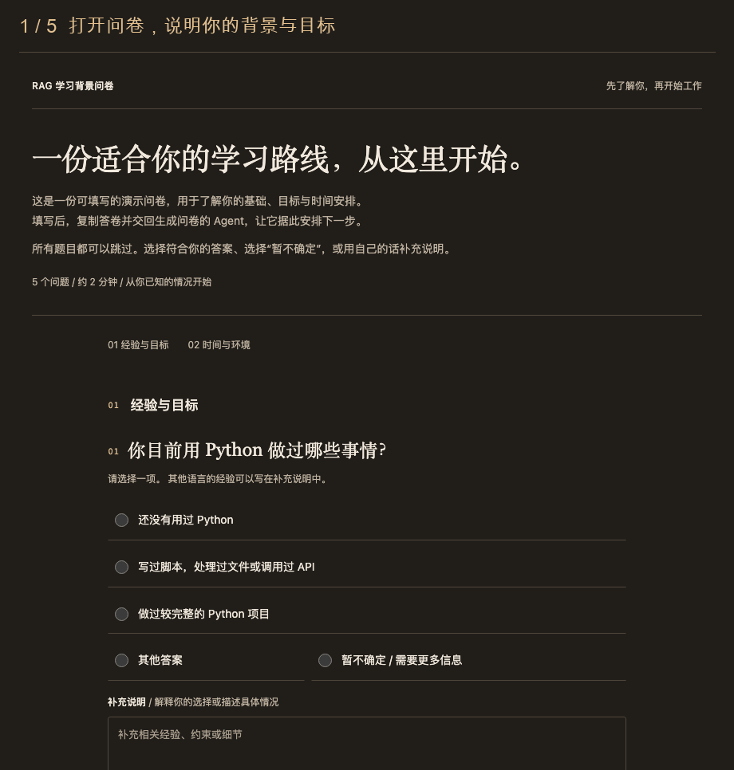

# HTML 问卷（HTML Questionnaire）

**让 AI 先了解你，再开始工作。**

生成一份离线 HTML 问卷，收集你的背景、目标与约束；填写后将精简答卷交回 Agent，用于制定学习路线、澄清项目需求和推进下一步。

[English](README.en.md) · [在线体验](https://nabudnye.github.io/html-questionnaire/) · [完整使用案例](examples/使用案例.md) · [skills.sh](https://skills.sh/nabudnye/html-questionnaire/html-questionnaire)

[](https://skills.sh/nabudnye/html-questionnaire)



## 安装后，说这一句

```sh
npx skills add nabudnye/html-questionnaire
```

> 我想学习 RAG。请用 html-questionnaire 生成一份中文 HTML 问卷，了解我的技术背景、学习目标和时间安排。等我交回答卷后，再帮我制定学习路线。

Skill 名称：`html-questionnaire` · 当前版本：`0.2.0` · 生成需要 Node.js 18+ · 填写只需浏览器

## 先试一份问卷

不需要安装 Agent，也可以直接体验页面中的选择、补充说明、答卷预览与下载：

| 场景 | 在线体验 | 问卷源数据 |
| --- | --- | --- |
| 根据背景制定 RAG 学习路线 | [中文问卷](https://nabudnye.github.io/html-questionnaire/) / [English](https://nabudnye.github.io/html-questionnaire/rag-learning.en.html) | [中文 JSON](examples/rag-learning.zh-CN.json) / [English JSON](examples/rag-learning.en.json) |
| 澄清个人知识库需求 | [中文问卷](https://nabudnye.github.io/html-questionnaire/knowledge-base.html) | [JSON](examples/knowledge-base.zh-CN.json) |

这些是固定的演示问卷。安装 Skill 后，Agent 会根据你的任务生成问题。在线演示仅负责填写与导出，不会连接模型或自动生成学习计划。[完整案例](examples/使用案例.md)展示了如何将答卷交回 Agent，以及回答如何影响下一步。

也可以下载仓库中的 [RAG 问卷 HTML](docs/index.html)，保存完整文件后在本地浏览器打开。

## 三步完成一次需求调研

1. **说明任务，主动发起问卷。** 例如：“我想做一个个人知识库，请先用 HTML 问卷了解我的需求。”
2. **打开生成的 HTML，按自己的情况填写。** 所有问题都可以跳过，也可以只写补充说明。
3. **复制 Markdown 答卷，或下载 `.md` / `.json` 交回 Agent。** 请它根据答卷继续原任务。

Agent 会结合已选答案和补充说明调整下一步。未填写的信息保持未知；如果这次只要求检查答卷格式，它就只进行格式检查。

## 为什么适合任务开始之前

- **一次集中说明背景。** 用单选、多选和补充说明表达经验、目标与约束。
- **保留不确定性。** 初始不预选，支持“暂不确定”和跳过，避免把空白当作否定。
- **交回精简答卷。** 省略未选选项、未回答题目和冗长提示，只保留实际回答。
- **离线填写。** 自包含 HTML，无需服务器、表单账户或外部资源；页面不会上传答案。
- **中英文界面。** 题目跟随用户语言生成；内置按钮、特殊选项和 Markdown 标题支持简体中文及英文。

本 Skill 面向**当前用户填写、用于当前任务**的背景与需求调研。普通学习请求、外部资料研究、面向客户等第三方的调查，以及明确要求在聊天中进行的访谈，保持各自的处理方式。

## 填写与隐私

每题都有“其他答案”“暂不确定”和独立的“补充说明”。清除选择会保留输入的文字；其他答案只有在该选项选中时才导出，补充说明可以单独导出。无法自动复制时，页面会选中答卷供手动复制。

**答案仅保存在页面内存中，刷新或关闭会丢失未导出的内容。** 离开前请复制或下载。你决定是否将答卷交给 Agent。托管演示的服务商会收到普通页面访问请求；问卷代码不发送答案，也不包含分析脚本。下载后的单文件可以完全离线使用。

当前不包含自动保存、答案导入、条件分支或后端服务。问卷无需密码、API 密钥等凭据。

## 安装、更新与兼容性

使用 [skills CLI](https://github.com/vercel-labs/skills) 安装时，按提示选择目标 Agent 和安装范围。也可以克隆仓库后从本地安装：

```sh
npx skills add . --skill html-questionnaire
```

已安装用户可以运行：

```sh
npx skills update
```

仓库采用通用 Agent Skills 目录结构，请保留完整目录及内部相对路径。浏览器验证与 CLI 安装验证的范围见下方；各 Agent 的自动发现、模型触发和完整会话效果尚未逐一实测，不将结构兼容视作已验证支持。

## 自己生成与维护演示

先按[数据格式说明](references/data-format.md)准备问卷数据，也可以直接使用示例：

```sh
node scripts/build.cjs examples/rag-learning.zh-CN.json questionnaire.html
```

生成无需额外 npm 依赖。输出目录需已存在；已有输出文件会被保留，修改后请使用新的文件名。没有 Node.js 的 Agent 可按数据格式说明中的替代流程组装单文件 HTML。

更新模板或示例后，重新生成三个公开演示页面：

```sh
node scripts/build-demos.cjs
node --test tests/*.test.cjs
```

`build-demos.cjs` 只覆盖 `docs/` 中三个约定的演示 HTML。GitHub Pages 使用 `main` 分支的 `docs/` 目录。

## 验证范围

本次在 macOS 上完成以下检查：

| 检查 | 结果与范围 |
| --- | --- |
| 核心与构建回归 | 6 项通过：默认英文兼容、中文导出、互斥选择、文字保留、安全嵌入、已有文件保护 |
| Chromium 151 桌面与手机尺寸 | 1280×900、390×844；中英文渲染、主要键盘操作、复制与手动回退、Markdown/JSON 下载、刷新清空、离线打开均通过；无控制台错误或外部资源请求 |
| skills CLI 1.7.0 安装 | 在临时项目中向 Codex、Claude Code 目录安装成功，并分别从安装后的脚本生成 HTML；测试安装关闭遥测 |
| Skill 结构 | frontmatter、命名和引用检查通过 |

Safari、Firefox、真实手机、完整无障碍审计及不同 Agent 的实际会话与自动触发尚未验证。

## 许可证

许可证尚待作者确定；当前没有声明额外的开源使用、修改或再分发授权。
